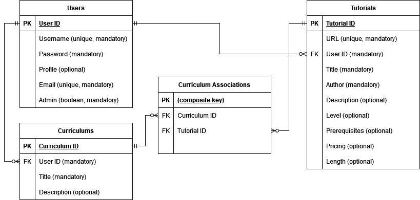

# Setup

Create a directory for learninglab and set up a virtual environment.

Run the command pip install -r requirements.txt in the terminal.

In postgreSQL, create a database and user to administrate it.

In /src, create an .env file with DATABASE_URL= "postgresql+psycopg2://<database_admin>:<password>@localhost:5432/<database>"

In the .env file, set SECRET_KEY="<JWT_secret_key>"

When moving to production, change the value of FLASK_DEBUG in .flaskenv to False

# Purpose of this API

People who are attempting to learn software and web development are faced with an immense amount of things to learn- languages, frameworks, CS fundamentals, systems, software. There are many tutorials and project ideas available on the internet from disparate sources, but it can be difficult to organize and take in all this information, or to devise a learning strategy that ensures all topics are covered in the desired depth and in an order that makes sense for the students' level and progression . My API aims to help with this problem by cataloging learning materials (tutorials, videos, courses, articles, etc) related to software development and allowing users to design their own curriculum constructed from learning materials they intend to study.

# Endpoints

## /auth/register POST
Register as a new user.

Required data: username, email, password of new user in JSON format

Response: user (email), JWT token

## /auth/login POST
Login as registered user.

Required data: email, password in JSON format

Response: user (email), JWT token

## /users/ GET
Get list of all registered users.

Required data: N/A

Response: id, username, profile, email, admin for all users

## /users/<user_id> GET
Get specified user by id.

Required data: N/A

Response: id, username, profile, email, admin for specified user

## /users/<user_id>/profile POST
Update own user profile.

Required data: profile in JSON format

Response: "Profile updated successfully"

Authentication: Requires an authorization header containing a JWT token corresponding to the specified user

## /users/<user_id> DELETE
Delete a user.

Required data: N/A

Response: id, username, password, profile, email, admin for specified user

Authentication: Requires an authorization header containing a JWT token corresponding to a user with admin privileges

## /tutorials/ GET
Get all posted tutorials.

Required data: N/A

Response: id, url, user_id, title, author, description, level, prerequisites, pricing, length for all tutorials

## /tutorials/<tutorial_id> GET
Get specified tutorial by id.

Required data: N/A

Response: id, url, user_id, title, author, description, level, prerequisites, pricing, length for specified tutorial

## /tutorials/users/<user_id> GET
Get all tutorials posted by specified user.

Required data: N/A

Response: id, url, user_id, title, author, description, level, prerequisites, pricing, length for all tutorials added by specified user

## /tutorials/authors/<author> GET
Get all tutorials with a certain author.

Required data: N/A

Response: id, url, user_id, title, author, description, level, prerequisites, pricing, length for all tutorials with specified author

## /tutorials/ POST
Add a tutorial.

Required data: url, title, author, description (optional), level (optional), prerequisites (optional), pricing (optional), length (optional) in JSON format

Response: id, url, user_id, title, author, description, level, prerequisites, pricing, length for added tutorial

Authentication: Requires an authorization header containing a JWT token corresponding to a logged-in user

## /tutorials/<tutorial_id>/edit POST
Edit details of previously added tutorial.

Required data: url (optional), title (optional), author (optional), description (optional), level (optional), prerequisites (optional), pricing (optional), length (optional) in JSON format

Response: id, url, user_id, title, author, description, level, prerequisites, pricing, length for edited tutorial

Authentication: Requires an authorization header containing a JWT token corresponding to the user who originally posted the tutorial

## /tutorials/<tutorial_id> DELETE
Delete a tutorial.

Required data: N/A

Response: id, url, user_id, title, author, description, level, prerequisites, pricing, length for deleted tutorial

Authentication: Requires an authorization header containing a JWT token corresponding to a a user with admin privileges

## /curriculums/ GET
Get all curriculums.

Required data: N/A

Response: id, title, user_id and description for all curriculums

## /curriculums/<curriculum_id> GET
Get specified curriculum by id.

Required data: N/A

Response: id, title, user_id and description for specified curriculum, plus id, url, user_id, title, author, description, level, prerequisites, pricing, length for all tutorials associated with specified curriculum.

## /curriculums/ POST
Add a new curriculum.

Required data: title, description (optional) in JSON format

Response: id, title, user_id and description for posted curriculum

Authentication: Requires an authorization header containing a JWT token corresponding to a logged-in user

## /curriculums/<curriculum_id> DELETE
Delete a curriculum.

Required data: N/A

Response: id, title, user_id and description for deleted curriculum

Authentication: Requires an authorization header containing a JWT token corresponding to the user who originally posted the curriculum

## /curriculums/<curriculum_id>/edit POST
Edit the details of a curriculum.

Required data: title (optional), description (optional) in JSON format

Response: id, title, user_id and description for edited curriculum

Authentication: Requires an authorization header containing a JWT token corresponding to the user who originally posted the curriculum

## /curriculums/<curriculum_id>/add POST
Add a tutorial to a curriculum.

Required data: tutorial_id in JSON format

Response: curriculum_id and tutorial_id for new association

Authentication: Requires an authorization header containing a JWT token corresponding to the user who originally posted the curriculum

## /curriculums/<curriculum_id>/<tutorial_id> DELETE
Delete a tutorial from a curriculum.

Required data: N/A

Response: "message": "Tutorial successfully removed from curriculum"

Authentication: Requires an authorization header containing a JWT token corresponding to the user who originally posted the curriculum

# Entity Relationship Diagram

# Third Party Services Used
This API uses Flask JWT Extended for authorization. This service handles generating JWT tokens based on a secret key, and also verifying tokens sent in requests by users. When the user sends a token, it is first checked for validity with the function verify_jwt_in_request(), and then the user ID corresponding to the token can be retrieved with get_jwt_identity() and used to query the database for other information, such as the user’s admin status and which curriculums and tutorials are theirs. These database queries are handled by SQLAlchemy, Flask-SQLAlchemy and psycopg. SQLAlchemy is an ORM for interacting with the database, and Flask-SQLAlchemy is an extension for easier integration of the former into a Flask app. These use models defined in Python to generate SQL queries and statements and interact with retrieved information inside the app, without requiring the programmer to write raw SQL. The use of SQLAlchemy also provides constraints which validate data by restricting what can be entered into a field. psycopg is a database adapter for PostgreSQL that handles low-level interactions with the database. Flask Marshmallow is used to define schemas, which are used to serialize data to JSON or deserialize it into native Python data types. Flask bcrypt is used to hash user passwords before storing them in the database, and to compare the stored password with the one entered by the user when they log in.
